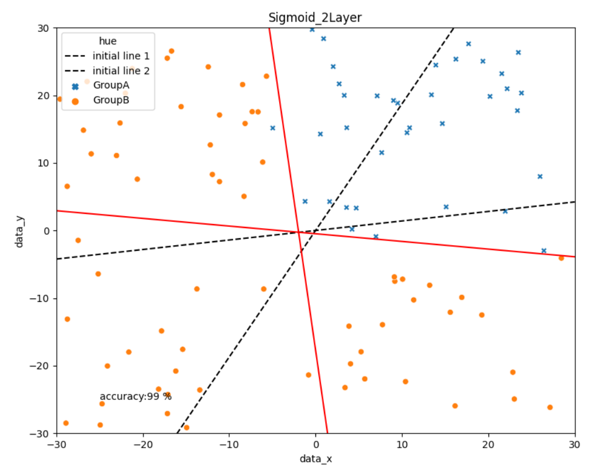

# Study of Neural-Network

> **AUTHOR** : HoHyun Cha (ghgus2006@naver.com)  
> **DATE** : '21.8/14

### Introduction

- The readme `md` is [here](./Summary_study_Neural_Net.md).

- Data Generator Python file is [here](data_generator.py)

- Theory Pyhton Code of Neural-Network is [[here_1 node]](./SingleLayer_1node.py) and [[here_2 node]](twolayer_2node.py)

### Result_2 node

 

Please check the `markdown` and `python` codes for understanding works.

### Reference

- Background and Theory [Github](https://github.com/SungwookLE/ReND_Car_TensorLab_with_NeuralNet)
