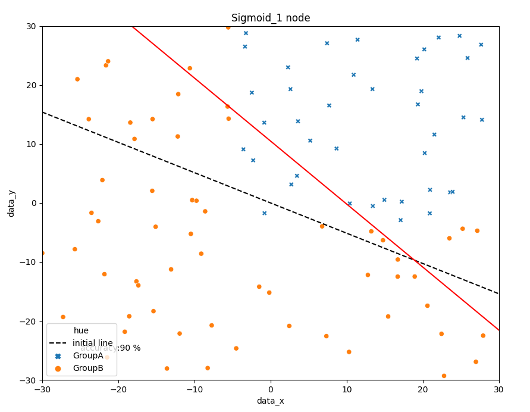
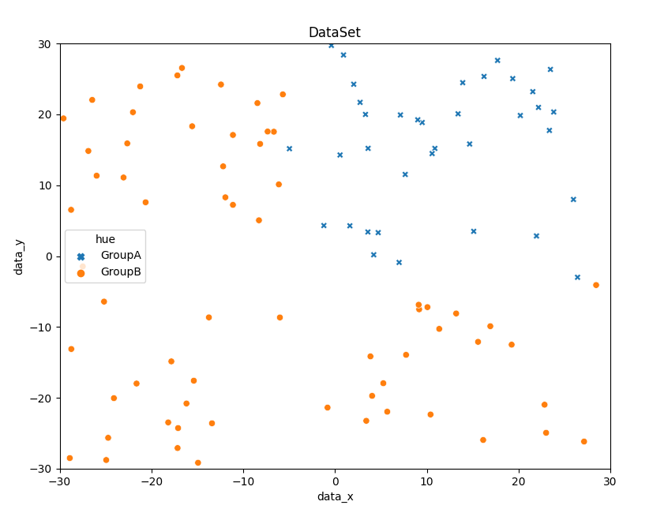
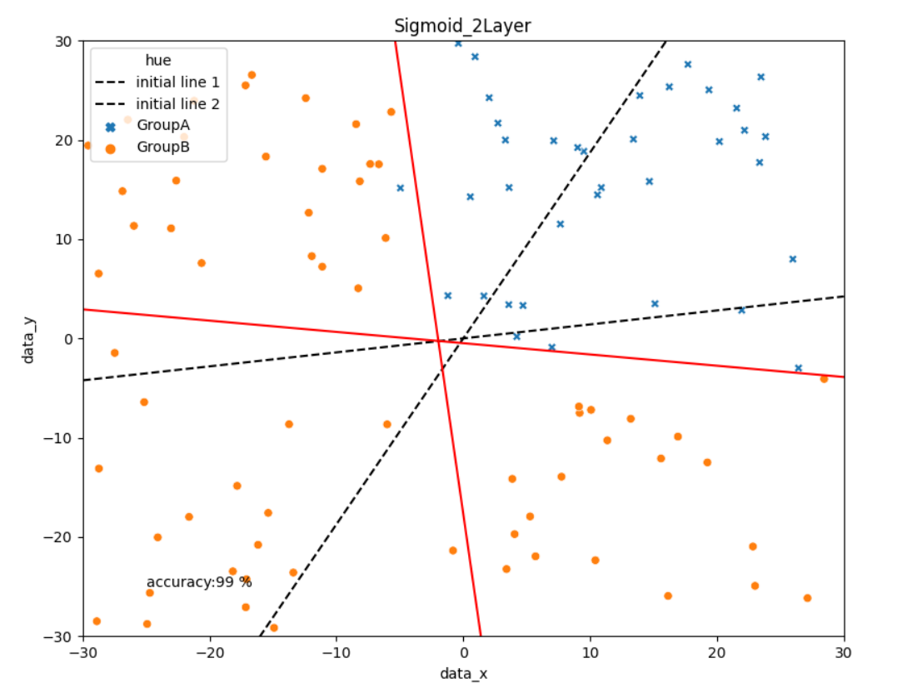

# Study of Neural-Network

> **AUTHOR** : HoHyun Cha (ghgus2006@naver.com)  
> **DATE** : '21.4/26

### Reference

- Background and Theory [Github](https://github.com/SungwookLE/ReND_Car_TensorLab_with_NeuralNet)
- [Linear Regression](https://datalabbit.tistory.com/49)
- [Linear Classifier](https://techdifferences.com/difference-between-linear-and-logistic-regression.html)
- [Neural Network BackPropagation](https://bskyvision.com/718)

### How to Execute

1. Create CSV data file by `data_generator.py`
2. Excute Neural-Net python file

- Single Perceptron (Only Out Layer) : `SingleLayer_1node.py`
- 2-Layer (h1, h2 : Hidden, o1 : Output Layer) : `twolayer_2node.py`

3.  Visualization by plt.show()

## [1] Linear Regression/Classification

#### **1. Linear Regression**

Before studying **Neural-Net**, we need to know about `Linear Regression` as background knowledge although linear model has limitation for performance.

- One of Supervised Learning
- [Proof of Linear Regression](https://datalabbit.tistory.com/49)
  Linear Regression is based on MSE(Mean Squared Error), which can minimize loss.
- [Python code for Linear Regression](http://hleecaster.com/ml-linear-regression-example/)

<center></center>

#### **2. Linear Classification**

There is an important difference between classification and regression problems. Fundamentally, classification is about predicting a **Label** and regression is about predicting a **Value**.

So, **Linear Classification** means it is a model that classifiers groups(Label) into two using line by combining Linear and Rogistic(like sigmoid) Regression.

- [Difference Linear Regression vs Classifier (logistic-regression)](https://techdifferences.com/difference-between-linear-and-logistic-regression.html)

<center></center>

<center></center>

<br>

### [1-1] Single Perceptron(Linear Classification)

<br>

This code is here : [SingleLayer_1node.py](SingleLayer_1node.py)

```python
import seaborn as sns
import pandas as pd
import numpy as np
import matplotlib.pyplot as plt
plt.figure(figsize=(9, 7))
plt.axis([-30, 30, -30, 30])

# import dataset.csv and processing Label

data = pd.read_csv("dataset.csv", index_col="Unnamed: 0")

# Activation functon

def sigmoid(x):
    y = 1/(1+np.exp(-x))
    return(y)

def relu(x):
    if x >= 0:
        y = x
    else:
        y = 0
    return y

def step(x):
    if x >= 0:
        y = 1
    else:
        y = 0
    return y

# Inital Value and Parameter

features = data[["data_x", "data_y"]]
Label = data["Label"]

n_feature = features.shape[1]
n_output = 1
iteration = 1000
learing_rate = 0.01

W = np.random.rand(n_feature, 1)
b = np.zeros(n_output)

# ForwardPropagation

def forward_propagtion(x, w, b, opt='sigmoid'):
    net_out = np.zeros(x.shape[0])
    function_out = np.zeros(x.shape[0])
    for i in range(data.shape[0]):
        x_i = x.iloc[i]
        net_out[i] = (np.matmul(x_i, w) + b)

        if (opt == 'sigmoid'):
            function_out[i] = sigmoid(net_out[i])
        elif (opt == 'relu'):
            function_out[i] = relu(net_out[i])

    return function_out

# Backpropagation

def back_propagation(x, y, w, b, learn_rate=learning_rate):
    net_out = np.zeros(x.shape[0])
    function_out = np.zeros(x.shape[0])

    for i in range(Label.shape[0]):
        x_i = x.iloc[i]
        net_out[i] = np.matmul(x_i, w) + b
        function_out[i] = sigmoid(net_out[i])

        w[0] = w[0] + learning_rate * (y.iloc[i] - function_out[i]) * function_out[i] * \
            (1-function_out[i]) * x_i[0]
        w[1] = w[1] + learning_rate * (y.iloc[i] - function_out[i]) * function_out[i] * \
            (1-function_out[i]) * x_i[1]
        b = b + learning_rate * (y.iloc[i] - function_out[i]) * function_out[i] * \
            (1-function_out[i]) * 1
    return w, b

# Initial line

line_x = np.linspace(-30, 30, 100)
line_y = -W[0] / W[1] * line_x - b / W[1]
plt.plot(line_x, line_y, '--k', label='initial line')

# Run whole batch

for i in range(iteration):
    activate_out = forward_propagtion(features, W, b, opt='sigmoid')
    W, b = back_propagation(features, Label, W, b)

# Accuracy

prediction = pd.Series(np.around(activate_out))
data["prediction"] = prediction

accuracy = 0
for i in range(data.shape[0]):
    if data["Label"].iloc[i] == data['prediction'].iloc[i]:
        accuracy += 1

sns.scatterplot(data=data, x="data_x", y="data_y",
                hue="hue", hue_order=["GroupA", "GroupB"],
                style="hue")

print(f'Accuracy : {accuracy} %')

# Visualization

line_x = np.linspace(-30, 30, 100)
line_y = -W[0] / W[1] * line_x - b / W[1]
plt.plot(line_x, line_y, 'r', label='final line')

plt.title('Sigmoid_1 node')
plt.text(-25, -25, 'accuracy:' + str(accuracy) + ' %')
plt.show()
```

<br>

### [1-2] Result of Single Perceptron

<br>

    Accuaracy : 90%

<br>



## [2] Non-linear Regression/Classification

In reality problem, there are so many non-linear models more than linear. Most of problems can't be applied just simple linear model based on reality.

- Non-Linear Regression, [Polynomial_Regression](https://cdm98.tistory.com/23)
<center></center>

- [Non-Linear Classfication](https://mangkyu.tistory.com/38)
<center></center>

</br>

### [2-1] How to Classifier `Non-Linear Classification`

</br>
<center> Non-Linear Classification
= Non-Linear Regression (2 hidden Layer) + Rogistic Regression (Out Layer)</center>
</br>
<center></center>

</br>

### [2-2] What is `Neural Network`?

</br>
<center>Compare to biological and artificial perceptron</center>
</br>
<center></center>
</br>

- [**Definition of Neural Network**] An artificial neural network, or just neural net, is a computational learning system that uses a network of functions to understand and translate a data input of one form into a desired output, usually in another form. The concept of the artificial neural network was inspired by human biology and the way neurons of the human brain function together to understand inputs from human senses.

- It was very widely used in 80s and early 90s; Popularity dimished in late 90s

- Recent resurgence: State-of-the-art technique for many applications

</br>

### [2-3] How to make `Neuron` model?

</br>

#### 1) Perceptron

</br>
<center></center>
</br>
<center></center>
</br>

- Activation Function : A function of converting thatvthe input signal variable equation (Node Net) to the output signal (Node Out)

  [Kind of Activation Function](https://subinium.github.io/introduction-to-activation/)

- Sigmoid, One of activation function can cause [Vanishing Gradient](https://muzukphysics.tistory.com/193)

#### 2) Neural Net work

<br>

[For example of whole process](https://bskyvision.com/718)
<br>

2-1) Feed Forward Propagtion

<center></center>

$N_{1, Out} = W_{11} X_1 + W_{21} * X_2 + b_1$  
 $N_{2, Out} = W_{12} * X_1 + W_{22} * X_2 + b_2$  
 $N_{3, Out} = SKIP$

<br>

$N_{1, Out} = Activation Function(N_{1, Out})$  
 $N_{2, Out} = Activation Function(N_{2, Out})$  
 $N_{3, Out} = SKIP$

<br>

$O_{Net} = W_{O,1}  N_{1, Out} + W_{O,2}  N_{2, Out} + W_{O,3} N_{3, Out}$  
 $O_{out} = Activation Function(O_{Net})$

<br>

2-2) Back Propagtion (Cost Function + Gradient Descent)

<center></center>

(1) Cost Function

<center></center>

<br>

(2) Gradient Descent

$Θ_i)_{Update} = Θ_i)_{Old} - η\frac{\partial}{\partialΘ_i}J(Θ)$

<br>
<center></center>
<br>

(2-3) Equation of `Out Layer Back-Propagation`

  <br>

  <center></center>
<br>

$W_{o,1})_{Update} = W_{o,1})_{Old} - η \; {\color{Red}\frac{\partial J(Θ)}{\partial W_{o,1}}}$

${\color{Red}\frac{\partial J(Θ)}{\partial W_{o,1}}} =\frac{\partial J(Θ)}{\partial Out_{o,1}} \times \frac{\partial Out_{o,1}}{\partial Net_{o,1}} \times \frac{\partial Net_{o,1}}{\partial W_{o,1}}$

<br>

$Net_{o,1} = W_{o,1} Out_{h1} + W_{o,2} Out_{h1} + b_{o}$

$Out_{o,1} = Sigmoid \; (Net_{o,1})$

$J(Θ) = \frac{1}{2m} \sum \limits_{i=1}^n {(Label - Out_{o,1})^2}$

<br>

$\frac{\partial J(Θ)}{\partial Out_{o,1}} = - (Label - Out_{o,1})$

$\frac{\partial Out_{o,1}}{\partial Net_{o,1}} = Sigmoid \; ^\prime(Net_{o,1}) =Out_{o,1}(1-Out_{o,1})$

$\frac{\partial Net_{o,1}}{\partial W_{o,1}} = Out_{h1} = X_{h1}$

<br>

> $W_{o,1})_{Update} = W_{o,1})_{Old} + η \;(Label - Out_{o,1}) \; Out_{o,1}(1-Out_{o,1}) \; X_{h1}$

<br>

(2-4) Equation of `Hidden Layer Back-Propagation`

<br>

<center></center>

<br>

$W_{w,11})_{Update} = W_{w,11})_{Old} - η \; {\color{Red}\frac{\partial J(Θ)}{\partial W_{w,11}}}$

${\color{Red}\frac{\partial J(Θ)}{\partial W_{w,11}}} = {\color{Blue}\frac{\partial J(Θ)}{\partial Out_{node,h1}}} \times \frac{\partial Out_{node,h1}}{\partial Net_{node,h1}} \times \frac{\partial Net_{node,h1}}{\partial W_{w,11}}$

${\color{Blue}\frac{\partial J(Θ)}{\partial Out_{node,h1}}} =\frac{\partial J(Θ)}{\partial Out_{node,o,1}} \times \frac{\partial Out_{node,o,1}}{\partial Net_{node,o,1}} \times \frac{\partial Net_{node,o,1}}{\partial Out_{node,h1}}$

<br>

$Net_{node,h1} = W_{w,11} X_1 + W_{w,12} X_2 + b_1$

$Out_{node,h1} = Sigmoid(Net_{node,h1})$

$Net_{node,o1} = W_{o,1} \; Out_{node,h1} + W_{o,2} \; Out_{node,h2} + b_{o}$

$Out_{node,o1} = Sigmoid(Net_{node,o1})$

$J(Θ) = \frac{1}{2m} \sum \limits_{i=1}^n {(Label - Out_{node,o1})^2}$

<br>

$\frac{\partial J(Θ)}{\partial Out_{node,o1}} = - (Label - Out_{node,o1})$

$\frac{\partial Out_{node,o1}}{\partial Net_{node,o1}} = Sigmoid \; ^\prime(Net_{o,1}) = Out_{node,o1}(1-Out_{node,o1})$

$\frac{\partial Net_{node,o,1}}{\partial Out_{node,h1}} = W_{o,1}$

$\frac{\partial Out_{node,h1}}{\partial Net_{node,h1}} = Sigmoid \; ^\prime(Net_{node,h1}) =Out_{node,h1}(1-Out_{node,h1})$

$\frac{\partial Net_{w,11}}{\partial W_{w,11}} = X_1$

<br>

> $W_{w,11})_{Update} = W_{w,11})_{Old} + η \;\{(Label - Out_{node,o1}) \; Out_{node,o1}(1-Out_{node,o1})\; W_{o,1}\}\;Out_{node,h1}(1-Out_{node,h1}) \; X_1$

> **$W_{w,12} \; W_{w,21} \; W_{w,22}$** `are like above Equation`

<br>

### [3] Practice

<br>



This code is here : [twolayer_2node.py](twolayer_2node.py)

```python
import timeit
import pandas as pd
import numpy as np
import seaborn as sns
import matplotlib.pyplot as plt
plt.figure(figsize=(9, 7))
plt.axis([-30, 30, -30, 30])

# Import dataset.csv file

data = pd.read_csv("dataset.csv", index_col='Unnamed: 0')

# Setting intial Values and Parameter

features = data[['data_x', 'data_y']].to_numpy()
Label = data['Label'].to_numpy()
n_features = features.shape[1]
n_label = Label.ndim
n_node = 2
iteration = 1000
learning_rate = 0.02

W_h = np.random.randn(n_features, n_node)
W_o = np.random.randn(n_node, n_label)
b_h = np.zeros(n_node)
b_o = np.zeros(n_label)

# Define activate function

def sigmoid(x):
    y = 1/(1 + np.exp(-x))
    return y


def relu(x):
    if x >= 0:
        y = x
    else:
        y = 0
    return y

# Define Derivate function

def D_sigmoid(x):
    y = sigmoid(x) * (1-sigmoid(x))
    return y

# Forward_Propagation

def Forward_propagation(x, w, b, opt='sigmoid'):
    node_net = np.zeros(len(x))
    node_out = np.zeros(len(x))
    for i in range(len(features)):
        x_i = x[i, :]
        node_net[i] = np.matmul(x_i, w) + b
        if (opt == 'sigmoid'):
            node_out[i] = sigmoid(node_net[i])
        else:
            node_out[i] = relu(node_net[i])
    return node_out

# Back_Propagation

def Back_propagation(x, y, W_h, W_o, b_h, b_o, learn_rate=learning_rate, operate_out=True, opt='sigmoid'):
    # O_out = np.zeros(len(x))

    if operate_out == True:
        for i in range(len(x)):
            y_i = y[i]
            O_out = Forward_propagation(x, W_o, b_o, opt='sigmoid')
            W_o[0] = W_o[0] + learn_rate * \
                (y_i - O_out[i]) * O_out[i] * (1-O_out[i]) * x[i, 0]
            W_o[1] = W_o[1] + learn_rate * \
                (y_i - O_out[i]) * O_out[i] * (1-O_out[i]) * x[i, 1]
            b_o = b_o + learn_rate * \
                (y_i - O_out[i]) * O_out[i] * (1-O_out[i]) * 1
        return W_o, b_o

    else:
        for i in range(len(x)):
            y_i = y[i]
            h1_out = Forward_propagation(
                features, W_h[:, 0], b_h[0], opt='sigmoid').reshape((-1, 1))
            h2_out = Forward_propagation(
                features, W_h[:, 1], b_h[1], opt='sigmoid').reshape((-1, 1))
            h_out = np.concatenate((h1_out, h2_out), axis=1)
            O_out = Forward_propagation(h_out, W_o, b_o)

            W_h[0, 0] = W_h[0, 0] + learn_rate * \
                (y_i - O_out[i]) * O_out[i] * (1-O_out[i]) * W_o[0] * \
                h1_out[i] * (1 - h1_out[i]) * x[i, 0]
            W_h[1, 0] = W_h[1, 0] + learn_rate * \
                (y_i - O_out[i]) * O_out[i] * (1-O_out[i]) * W_o[0] * \
                h1_out[i] * (1 - h1_out[i]) * x[i, 1]
            W_h[0, 1] = W_h[0, 1] + learn_rate * \
                (y_i - O_out[i]) * O_out[i] * (1-O_out[i]) * W_o[1] * \
                h2_out[i] * (1 - h2_out[i]) * x[i, 0]
            W_h[1, 1] = W_h[1, 1] + learn_rate * \
                (y_i - O_out[i]) * O_out[i] * (1-O_out[i]) * W_o[1] * \
                h2_out[i] * (1 - h2_out[i]) * x[i, 1]
            b_h[0] = b_h[0] + learn_rate * \
                (y_i - O_out[i]) * O_out[i] * (1-O_out[i]) * W_o[0] * \
                h1_out[i] * (1 - h1_out[i]) * 1
            b_h[1] = b_h[1] + learn_rate * \
                (y_i - O_out[i]) * O_out[i] * (1-O_out[i]) * W_o[1] * \
                h2_out[i] * (1 - h2_out[i]) * 1
        return W_h, b_h

# Drawing intial line(before learning)

x_line = np.linspace(-30, 30, 100)
y_line1 = - W_h[0, 0] / W_h[1, 0] * x_line - b_h[0] / W_h[1, 0]
y_line2 = - W_h[0, 1] / W_h[1, 1] * x_line - b_h[1] / W_h[1, 1]
plt.plot(x_line, y_line1, '--k', label='initial line 1')
plt.plot(x_line, y_line2, '--k', label='initial line 2')
print(f'Accuracy : {accuracy} %')

# Run whole batch

start_time = timeit.default_timer()  # Check initial time
for i in range(iteration):
    # Forward-Propagation
    h1_out = Forward_propagation(
        features, W_h[:, 0], b_h[0], opt='sigmoid').reshape((-1, 1))
    h2_out = Forward_propagation(
        features, W_h[:, 1], b_h[1], opt='sigmoid').reshape((-1, 1))
    node_h_out = np.concatenate((h1_out, h2_out), axis=1)
    node_o_out = Forward_propagation(node_h_out, W_o, b_o)

    # Back-Propagation
    W_o, b_o = Back_propagation(
        node_h_out, Label, 0, W_o, 0, b_o, operate_out=True)

    W_h, b_h = Back_propagation(
        features, Label, W_h, W_o, b_h, b_o, operate_out=False)
terminate_time = timeit.default_timer()  # Check final time
acting_time = round(terminate_time - start_time, 1)
print(f'{acting_time}초 걸렸습니다.')

# Accuracy

prediction = pd.Series(np.around(node_o_out))
data['prediction'] = prediction

accuracy = 0
for i in range(data.shape[0]):
    c1 = data["Label"].iloc[i]
    c2 = data['prediction'].iloc[i]
    if c1 == c2:
        accuracy += 1
print(f'Accuracy : {accuracy} %')

# Visualization

sns.scatterplot(data=data, x="data_x", y="data_y",
                hue="hue", hue_order=["GroupA", "GroupB"],
                style="hue")
y_line3 = - W_h[0, 0] / W_h[1, 0] * x_line - b_h[0] / W_h[1, 0]
y_line4 = - W_h[0, 1] / W_h[1, 1] * x_line - b_h[1] / W_h[1, 1]
plt.plot(x_line, y_line3, 'r', label='final line 1')
plt.plot(x_line, y_line4, 'r', label='final line 2')
plt.title('Sigmoid_2Layer')
plt.text(-25, -25, 'accuracy:' + str(accuracy) + ' %')
plt.show()
plt.savefig('./twolayer_2node_result_learnrate_0.02')
```

### [3-1] Result of Practice

<br>

    Accuaracy : 99.5%

<br>


